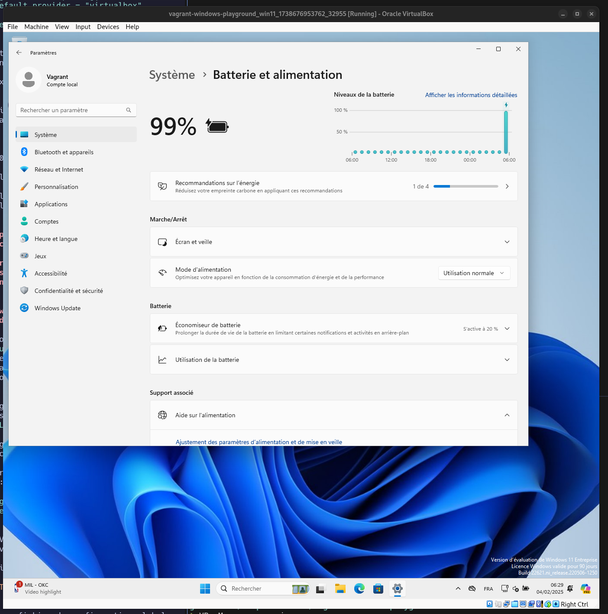

# Launch Windows 11 VM in VirtualBox with Vagrant

To create this playground, I based my work on the content of the following repository: <https://github.com/splitbrain/vagrant-windows11/tree/master>.

I have no idea if I can trust the box: `gusztavvargadr/windows-11`.

If you want to build your own box with Packer, you can look at: https://github.com/rgl/windows-vagrant (I haven't tried it).

## Prepare your computer (only for Fedora)

1. disable secure boot.
2. Configure RPM Fusion (if you haven't already):

```sh
$ sudo dnf install https://mirrors.rpmfusion.org/free/fedora/rpmfusion-free-release-$(rpm -E %fedora).noarch.rpm https://mirrors.rpmfusion.org/nonfree/fedora/rpmfusion-nonfree-release-$(rpm -E %fedora).noarch.rpm
```

3. Install VirtualBox package

```sh
$ sudo dnf install -y VirtualBox
```

4. Configure Hashicorp RPM repository to install Vagrant (if you haven't already):

```sh
$ sudo dnf install -y dnf-plugins-core
$ sudo dnf config-manager --add-repo https://rpm.releases.hashicorp.com/fedora/hashicorp.repo
```

5. Install Vagrant:

```sh
$ sudo dnf -y install vagrant
```

6. Checking installed versions:

```sh
$ vagrant version
Installed Version: 2.4.3
Latest Version: 2.4.3
```

```sh
$ VBoxManage --version
7.1.4_rpmfusionr165100
```

## Getting started

```sh
$ vagrant up
$ vagrant ssh
Microsoft Windows [version 10.0.22631.4169]
(c) Microsoft Corporation. Tous droits réservés.

vagrant@WIN11 C:\Users\vagrant>
```


